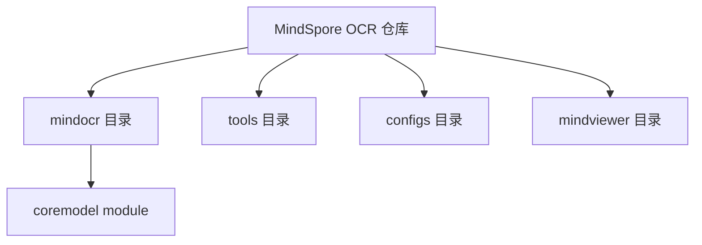
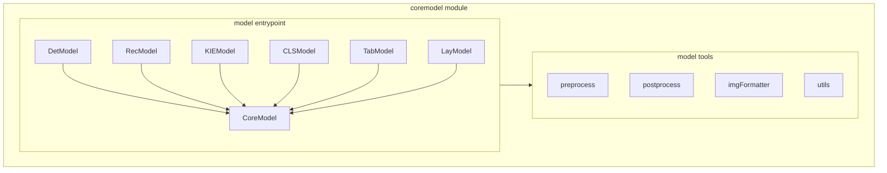
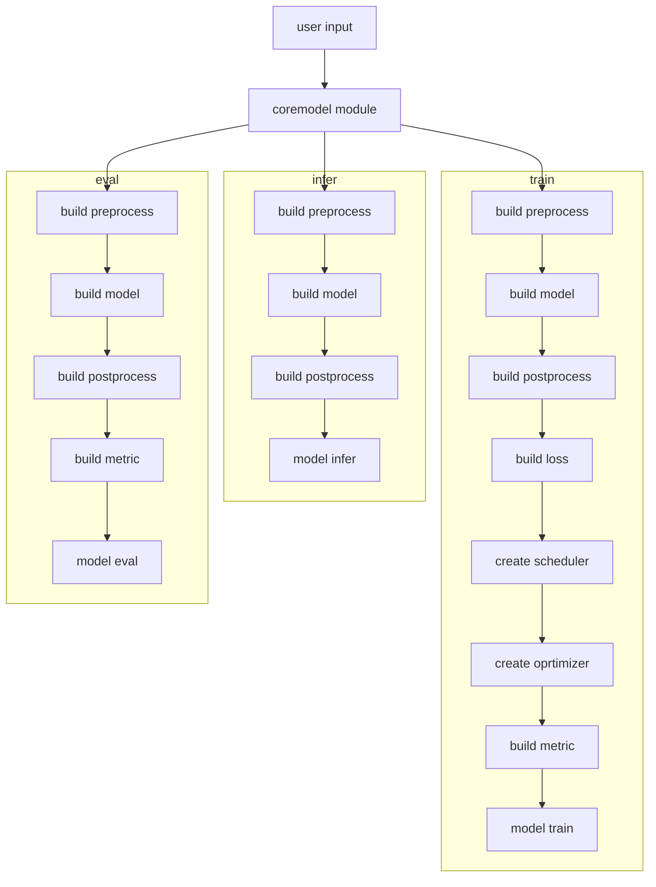
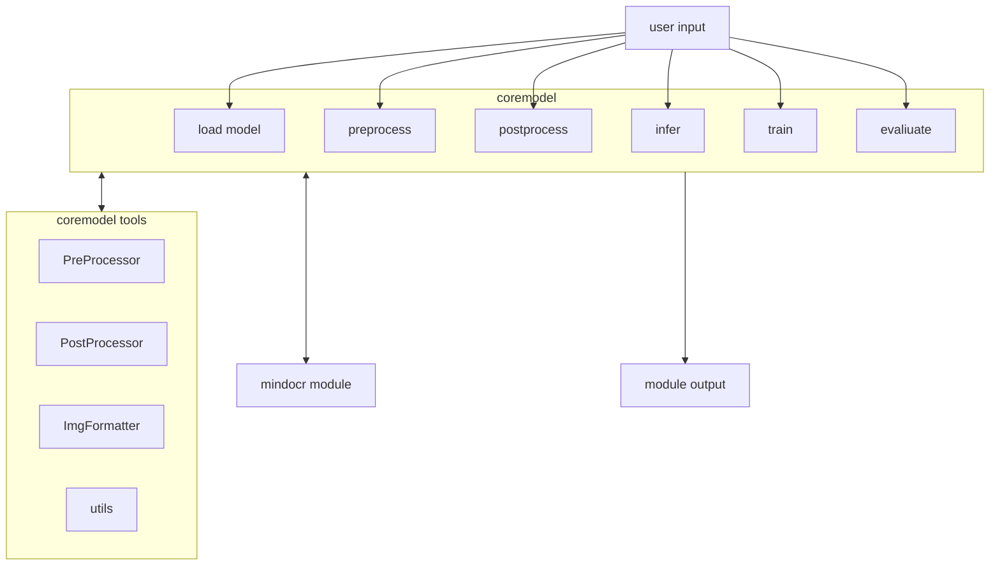
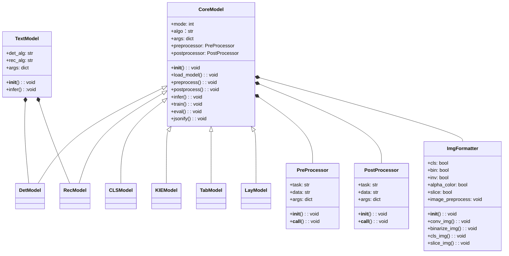

| _***日期***_ | _***修订版本***_ | _***修改章节***_ | _***修改描述***_ | _***作者***_                                            |
| ---------- | ------------ | ------------ | ------------ | ----------------------------------------------------- |
| 2024-08-19 | 1.0          |              |    完成初稿    | zhangjunlong
| 2024-09-09 | 1.1          |              |    更新设计整合    | zhangjunlong
## 前言

MindSpore OCR（以下简称MindOCR）套件是基于MindSpore AI框架开发的OCR开源工具包，集成文本检测、文本识别等业界主流算法模型，并提供端到端的应用工具，帮助用户快速开发OCR领域模型，满足用户通用OCR场景与复杂文档分析场景的生产落地需求。

围绕MindOCR的产品定位，本人的工作范围包括但不限于：
1. 负责MindOCR套件自有模型丰富度提升：实现1~2个关键模型，打通模型迁移流程，降低模型迁移门槛，牵引社区开源贡献，最终实现模型丰富度的显著提高；
2. 负责通用OCR场景使用与开发的易用性提升：提升套件使用的便捷性，降低套件开发的复杂度，使MindOCR套件更好服务于生产落地需求；
3. 负责MindOCR动态图模式的支持；
4. 负责MindOCR语言分析系统的支持；

经实践发现，MindOCR在910B与MindSpore2.3.0的环境下已能够较好地支持动态图模式；语言分析系统在实际生产落地的需求中优先级较低，故第3、4项任务暂时不在主要工作中呈现。

由此，本人重点工作项如下图黄色模块所示：

<p align="center">
  
</p>
<p align="center">
  <em> 图1. 重点工作示意图 </em>
</p>

上图整图为当前MindOCR工作全景图，绿色模块为当前MindOCR套件已支持的部分，黄色模块与灰色模块为待重点开展的工作，其中黄色模块为本人重点工作。

本文档主要围绕图1中的coremodel模块展开。coremodel模块属于通用OCR系统基础库下的子模块，旨在提升MindOCR开发与使用的易用性，提升套件使用的便捷性，降低套件开发的复杂度，使MindOCR套件更好服务于生产落地需求。本文将从背景与目的、上下文定义、总体结构、模块设计几个层面进行描述。

## 一、简介

### 1.1 背景

图2为MindOCR整体组件图。如图所示，MindOCR项目主要包括mindocr库、tools库、configs库三个模块。用户在调用模型进行推理时，不能直接调用mindocr库，而需要调用tools库中对应的predict模块，每个predict模块负责执行不同的推理任务。同样地，用户在进行模型训练与评估时，也不能直接调用mindocr库，而需要调用tools库中的train或eval模块，再通过该模块调用configs目录下的配置文件，获取配置参数后进行训练或推理。

<p align="center">
  
</p>
<p align="center">
  <em> 图2. MindOCR原始整体组件图 </em>
</p>

由于运行mindocr库需要依赖于tools库以及configs库，故MindOCR难以通过导入依赖包与调用接口的方式进行使用，存在使用复杂度高、开发自由度小、处理灵活性不足等情况，难以满足生产落地需求：

1、运行入口不统一，用户使用复杂度高

目前MindOCR支持Det、Rec、KIE、Layout、Table等多种模型的推理、训练与评估任务，对于不同推理任务分别需调用各自对应的推理脚本（如`predict_det`, `predict_rec`, `predict_ser`等）；而对于训练与评估，同样需要分别调用对应的训练与评估脚本。随着MindOCR模型库和新功能的支持（如智能文档分析系统），大量不同的调用入口将给开发者的使用带来较高的复杂度，亟需得到改善。

我们希望用户可以基于统一的类对象去实现各类任务（如模型加载、推理、训练与评估），用户安装mindocr后可通过统一的接口或命令进行推理、训练、评估，由此降低用户使用复杂度。

2、运行mindocr库依赖tools、configs库，用户使用的便捷性不足

目前MindOCR在运行推理、训练、评估任务时，需要依赖于tools与configs库，因此须将项目全量clone至本地，无法在导入mindocr包后直接通过python调用，这将导致用户使用的快速性与便捷性不足。

我们希望运行mindocr库不需要依赖其他库外组件，用户安装mindocr后通过几行python命令即可进行推理、训练、评估，由此提升用户使用的快速性与便捷性。

3、未提供用户开发接口，用户开发自由度不足

由于目前MindOCR未提供用户开发接口，当用户开发自己的模型或更换部分模块/功能时，需要将MindOCR项目全量clone至本地，按照mindocr各组件逻辑进行“模型迁移式”开发，这将导致用户开发自由度不足。

我们希望通过设计统一的抽象接口，开发者在安装并导入mindocr后，仅需通过提供的接口实现自己的私有模型或其他所需组件即可完成特定任务的开发，以此提高用户在开发过程中的自由度。

4、缺少输入图像前置处理模块，灵活性不足

MindOCR当前缺少对输入图像的预处理模块，如格式转化、大图切片、透明填充、图像二值化、颜色反转、角度调整、批量推理等。

我们希望用户在输入图像时可根据自身需要对输入进行处理，以提高用户使用精度与输入处理的灵活性。


### 1.2 目的

如上所述，由于MindOCR运行入口未统一，需要依赖mindocr库外部模块，且未提供用户开发接口，存在使用复杂度高、开发便捷性与自由度不足等问题，亟需得到改善。

针对这些问题，本文档希望通过coremodel模块的设计进行解决。如下图所示，coremodel模块在mindocr库下集成了各组件功能，通过CoreModel类抽象出模型加载、数据前处理、后处理、推理、训练、评估等方法，其作用包括但不限于
1. 开发者可通过CoreModel类或相应子类即可进行推理、训练、评估等任务。
2. CoreModel模块将各组件功能集成与mindocr库中不需要依赖外部模块，开发者在安装与导入mindocr包后调用接口即可使用。
3. 开发者也可通过重写或实现coremodel接口来构建私有的模型训练、推理等相关任务，无须通过clone整个项目进行开发。

除此之外，本文档还提供了图片预处理工具的方案。

<p align="center">
  
</p>
<p align="center">
  <em> 图3. coremodel设计方案组件图 </em>
</p>

通过coremodel模块，mindocr新增但不限于如下调用方式：

1、模型推理

当前MindOCR推理通过调用tools库下的脚本文件运行，其调用方式如下：
```
python tools/infer/text/predict_system.py --image_dir {path_to_img or dir_to_imgs}  --det_algorithm DB++  --rec_algorithm CRNN
```

支持CoreModel模块后，可通过如下方式运行MindOCR图像识别功能。其中RecModel为CoreModel子类，用于执行文字识别相关任务。
```python
from mindocr import RecModel
model = RecModel(rec='CRNN', **args) 
result = model.infer(img_path, **args)
```

2、模型训练

当前MindOCR训练通过调用tools库脚本以及configs库中的配置文件运行，且调用方式如下：
```
python tools/train.py --config path/to/model_train_config.yaml
```

支持CoreModel模块后，可通过如下方式启动模型训练程序。其中，DetModel为CoreModel子类，用于实现文字检测任务。
```python
from mindocr import DetModel
model = DetModel(det='DB', **args)
model.train(data_path, ckpt_path, **args)
```

用户亦可通过接口定义自己的前处理、后处理以及模型等模块，通过接口训练自有模型：
```python
from mindocr import CoreModel
class UserModel(CoreModel)：
    def load_model(**args):
      pass

    def preprocess(**args):
      pass

    def postprocess(**args):
      pass

model = UserModel(**args)
model.train(data_path, ckpt_path, **args)
```

3、模型评估

当前MindOCR通过调用tools库脚本以及configs库中的配置文件进行模型评估，使用方法如下：
```
python tools/eval.py --config path/to/config.yaml
--opt dataset_root  ckpt_load_path
```
支持CoreModel模块后，评估流程可通过如下形式实现：
```python
from mindocr import RecModel
model = RecModel(alg='CRNN', **args)
model.eval(data_path, ckpt_path, **args)
```

由此，通过MindOCR coremodel模块下的CoreModel抽象类，将模型各行为进行统一，实现模型的训推一体化。

### 1.4 范围
#### 1.4.1 软件名称
MindOCR coremodel module
#### 1.4.2 软件功能
1. 用户通过统一API接口实现模型的推理、训练、评估等；
2. 用户通过抽象类的API接口实现自有模块的开发；
2. 支持OCR输入图像预处理功能

## 二、第零层设计描述
---
### 2.1 软件系统上下文定义
安装的环境要求：同 MindOCR 安装的环境要求。

MindOCR coremodel 模块的部署视图如下所示，主要位于通用OCR模块的mindocr库中，通过mindocr库中组件的调用实现训推一体函数式调用功能。

<p align="center">
  
</p>
<p align="center">
  <em> 图4. MindOCR更新部署视图 </em>
</p>


新增的 MindOCR coremodel 模块在mindocr目录下，其中包含了CoreModel抽象类及其相关的组件。新增模块对原有tools功能无影响。

<p align="center">
  <em> 图5. MindOCR更新目录结构 </em>
</p>

### 2.2 设计约束
#### 2.2.1 遵循标准
遵循Apache 2.0
#### 2.2.2	硬件限制
Ascend：910A、910B
GPU：支持cuda10.1以上
CPU
#### 2.2.3 技术限制
GPU、CPU暂不支持MindSpore 2.3
#### 2.2.4 系统配置
openEuler: >= 20.3
CentOS：>= 7.6
Ubuntu：>= 18.04
Windows 10
MacOS：10.15/11.3


# 三、第一层设计描述
---
## 3.1 总体结构

MindOCR coremodel 模块整体架构如下图所示

<p align="center">
  <em> 图6. MindOCR coremodel模块总体结构 </em>
</p>

## 3.2 分解描述
1. model entrypoint模块：定义了CoreModel抽象类以及各任务子类，用户通过对应的类调用推理、训练、评估等模型方法；
   + CoreModel：
   模型统一抽象类，抽象出各类模型模型加载、数据前后处理、推理、训练、评估的通用方法，开发者可基于该抽象类实现自己的私有模块；
   + DetModel：
   检测模型统一调用入口，用于文本检测相关任务;
   + RecModel：
   识别模型统一调用入口，用于文本识别相关任务;
   + KIEModel：
   关键信息提取模型统一调用入口，用于文本关键信息提取相关任务;
   + CLSModel：
   文本方向分类模型统一调用入口，用于文本方向分类相关任务;
   + TabModel：
   表格识别模型统一调用入口，用于表格识别相关任务;
   + LayModel：
   版面分析模型统一调用入口，用于版面分析相关任务;

2. model tools 模块：工具模块，为model entrypoint模块提供必需的运行工具或组件。
   + preprcess：数据前处理工具
   + postprocess：数据后处理工具
   + imgFormatter：用于对输入图像进行预处理
   + utils：公共工具方法模块

## 3.3 运行设计

新增MindOCR coremodel模块后运行流程如下。通过OCRCore模块的设计，将原有分散的推理、训练、评估流程进行了统一，开发者在导入包后可直接通过调用接口进行模型调用，也可利用接口自行开发模型。


<p align="center">
  <em> 图7. MindOCR coremodel模块运行流程图 </em>
</p>


# 四、第二层设计描述
## 4.1 coremodel模块设计

#### 4.1.1 总体结构

<p align="center">
  <em> 图8. MindOCR coremodel模块总体结构设计图 </em>
</p>

#### 4.1.2 模块分解描述
当前coremodel模块向用户提供获取模型实例、数据前处理实例、数据后处理实例、进行模型推理、训练与评估等功能与接口。coremodel模块通过调用mindocr中各功能组件与coreodel tools中的工具来实现。
 

#### 4.1.3 数据实体描述



<p align="center">
  <em> 图9. MindOCR coremodel模块类图 </em>
</p>

CoreModel抽象类有如下公共变量：

- `mode`：运行模式，0为graph模式，1为pynative模式
- `algo`：算法模型名
- `args`：配置参数，用户自定义或系统默认值
- `preprocessor`：前处理过程
- `postprocessor`：后处理过程
- `init()`：类的初始化方法
- `load_model()`：模型加载，用户可自定义
- `preprocess()`：模型前处理过程，用户可自定义
- `infer()`：模型推理过程，用户可自定义
- `train()`：模型训练方法，用户可自定义
- `eval()`: 模型评估方法，用户可自定义
- `jsonify()`: 将输出转为json格式

ImgFormatter类有如下公共变量：

- `cls`: 是否使用角度分类器。默认为True
- `bin`: 将图像二值化为黑白。默认为False
- `inv`: 反转图像颜色。默认为False。
- `alpha_color`: 设置透明部件更换的RGB颜色元组。默认为纯白色
- `slice`: 对大图像使用滑动窗口推理。
- `__init__()`: 初始化ImgFormatter类成员变量
- `__call__()`: 图像前处理操作pipeline
- `conv_img()`: 图像格式转换，可支持gif、pdf文件转换
- `binarize_img()`: 图像二值化方法
- `cls_img()`: 角度分类器方法
- `slice_img()`: 图像切片滑动窗口处理方法


#### 4.1.4 依赖性描述

外部第三方依赖库：opencv、numpy

#### 4.1.5 接口使用描述

coremodel接口使用方法描述包括模型训练、推理与评估，详细参见本文1.2节

